# 动画

## 目标

### 2d 转换

#### translate

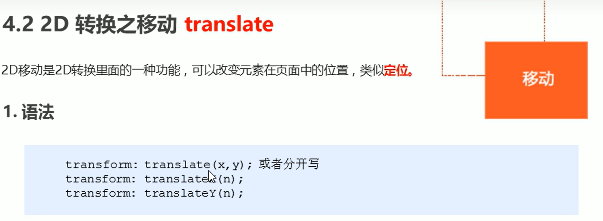
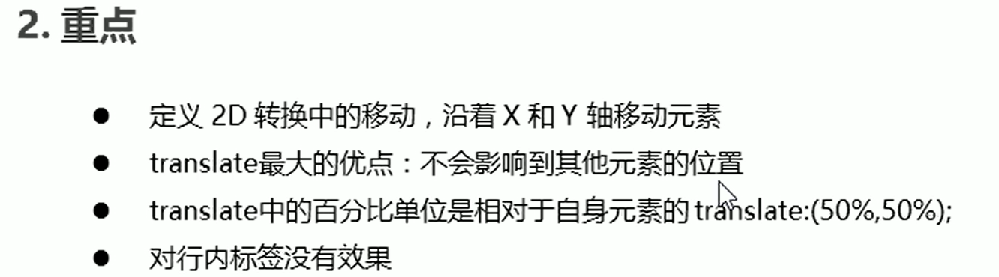

#### rotate

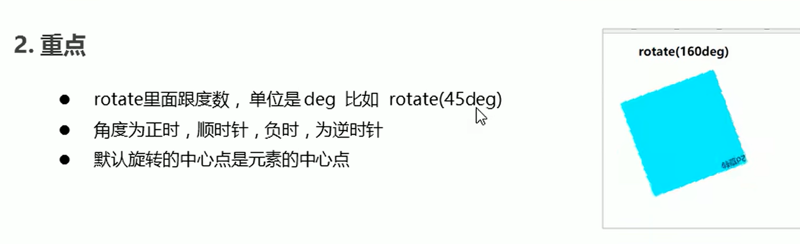

#### scale

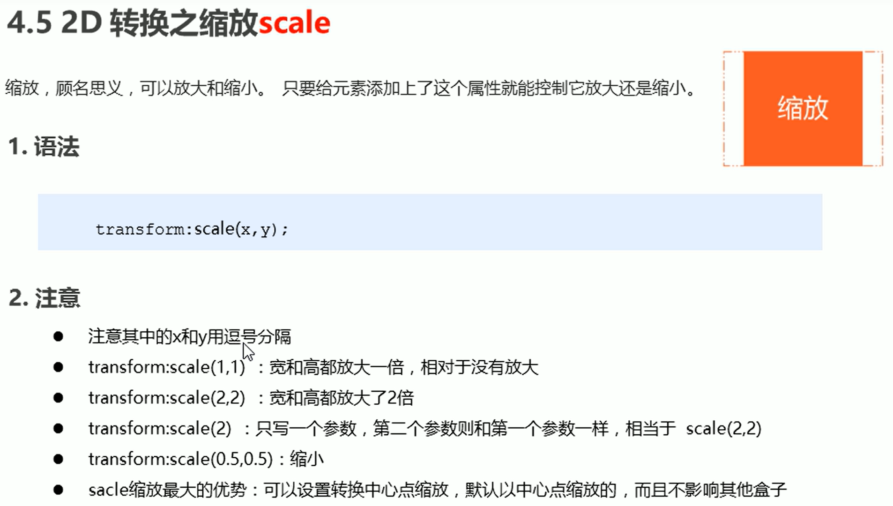

#### 综合写法

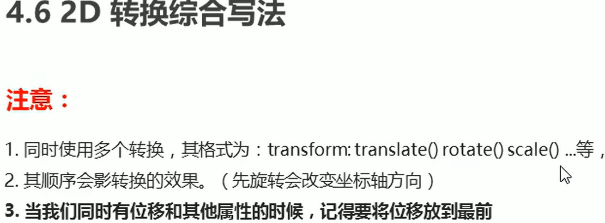

### 动画

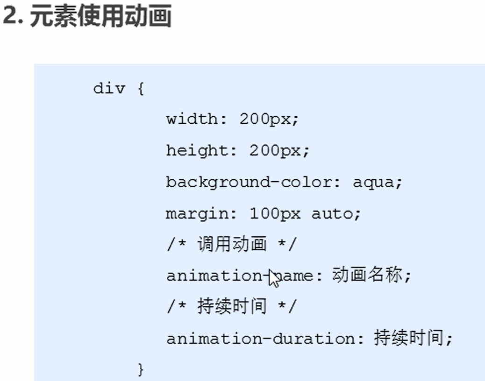

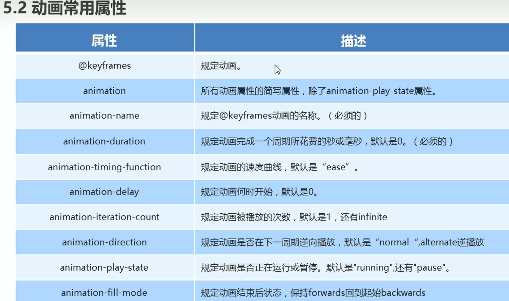
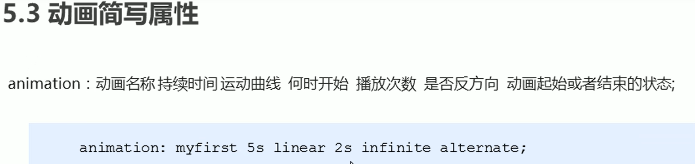
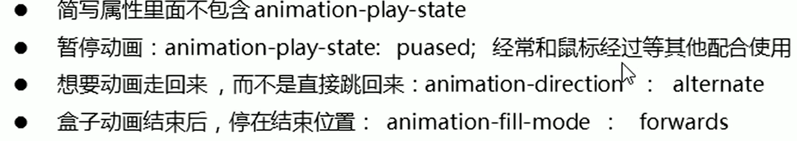

### 3d 转换

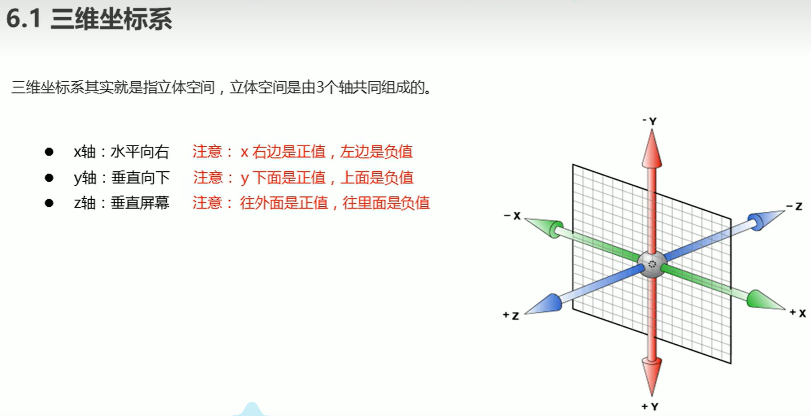

#### translate3d

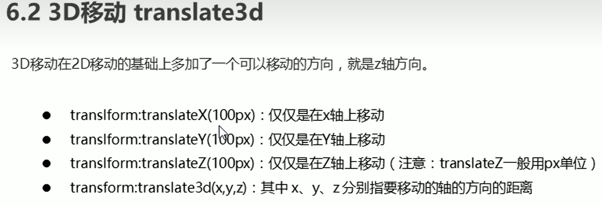

#### perspective 透视

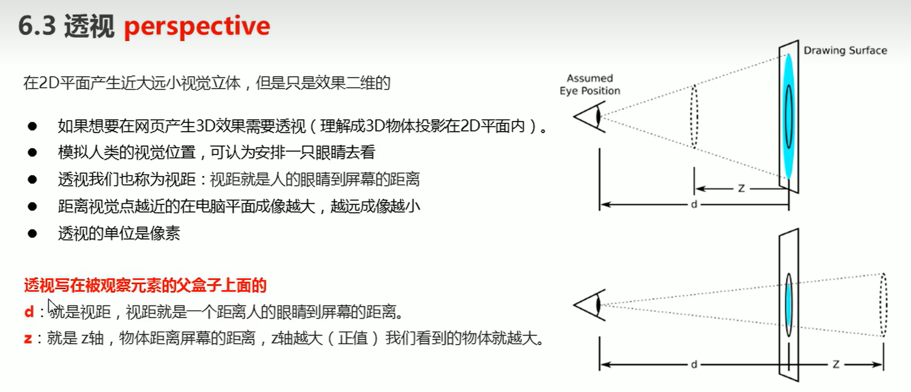

#### rotate3d

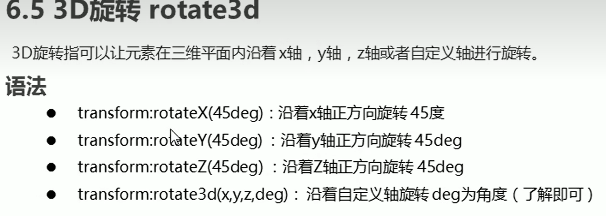

- rotateX
  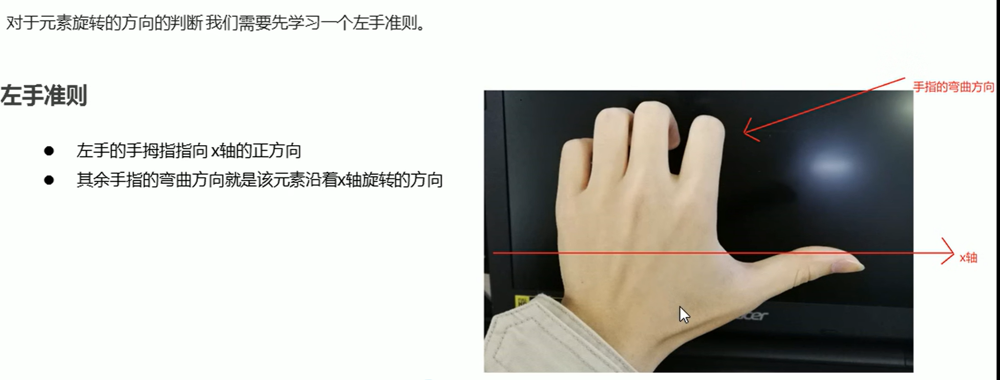
- rotateY
  
- rotate3D
  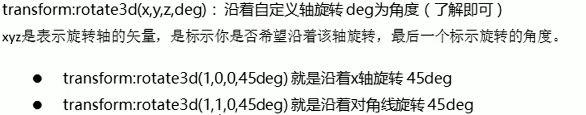

#### transform-style

### 浏览器私有前缀

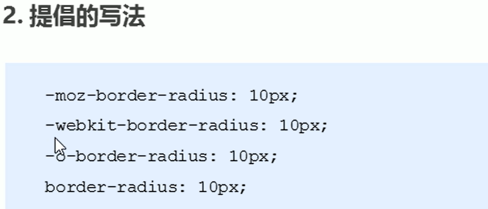
