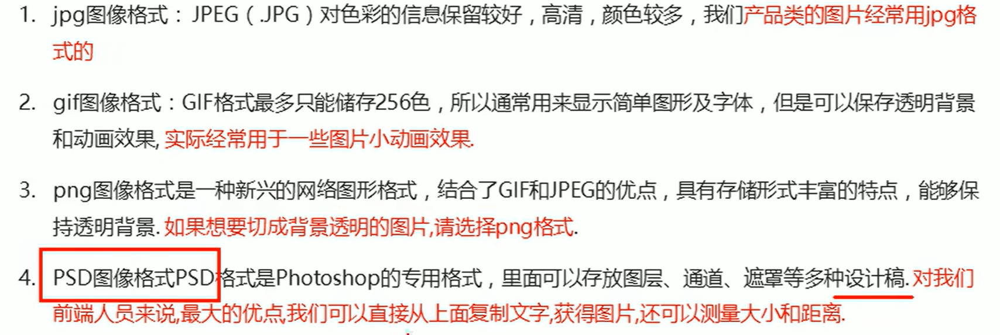

# 浮动

## 概要

### 行内块元素问题

- 行内块元素中间有缝隙

- 多个盒子纵向排列，用标准流最合适 

- 多个盒子横向排列，应用浮动(不会有间隙)


@import "t00.html"


### 为什么需要浮动

完成标准流不能完成的横向排列


@import "t01.html"


### 浮动的排列特性

float 属性用于创建浮动框，将其移动到一边，直到左边缘或右边缘触及包含块或另一个浮动框的边缘

```css
div {
  /* none:默认不浮动 left 向左浮动 right 向右浮动 */
  float: left;
}
```

1.浮动元素会脱离标准流

```txt
1.脱离标准流得控制(浮)移动到指定位置(动)(俗称脱标)
2.浮动的盒子不再保留原来的位置
```

2.浮动元素会一行内显示并且元素顶部对齐

3.浮动元素会具有行内块元素得特性


@import "t02.html" {title="脱标"}
@import "t03.html" {title="浮动盒子一行显示"}
@import "t04.html" {title="行内块特性"}
@import "t05.html" {title="浮动元素搭配标准流1"}
@import "t06.html" {title="浮动元素搭配标准流2"}
@import "t07.html" {title="浮动元素搭配标准流3"}


### 能够说出为什么要清除浮动

由于父盒子很多情况下不方便给高度，但是盒子浮动又不占用位置，最后父级盒子高度为 0 时，就会影响下面的标准流盒子

清除浮动的本质就是清除浮动元素造成的影响

清除浮动后，父级就会根据浮动的子盒子自动检测高度，父级有了高度，就不会影响下面的标准流

```css
div {
  /* left:清除左侧浮动 right:清除右侧浮动 both:同时清除两侧浮动的影响 */
  clear: xxx;
}
```

清除浮动策略：闭合浮动

- 清除浮动方法

  1.额外标签法，也称隔墙法，w3c 推荐 2.父级添加 overflow 3.父级添加 after 伪元素 4.父级添加双伪元素


@import "t08.html" {title="额外标签法"}
@import "t09.html" {title="父级添加 overflow"}
@import "t10.html" {title="父级添加 after 伪元素"}
@import "t11.html" {title="父级添加双伪元素"}


## 传统网页布局 3 种方式

1.普通流(普通流/文档流)

2.浮动

浮动盒子只会影响到后面的标准流

3.定位

## 常见网页布局


## PS 切图



### 图层切图

- 右击图层，快速导出为 PNG 格式
- 如果多个图层组成一个，需要 ctrl + E 合并为一个图层再导出

### 切片切图

使用切片工具


选择需要导出的区域，另存为要选择选中的切片


切片调整 \*使用后直接鼠标编辑
或用切片选择工具修改位置

使用完后 delete 删除切片
