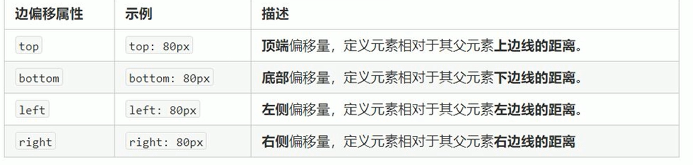

# 定位

## 导读

### 为什么要用定位

1.任意移动某个控件位置

2.滚动窗口时，盒子固定屏幕某个位置

- 浮动可以让多个块级盒子一行没有缝隙显示，经常用于横向排列盒子
- 定位则是可以让盒子自由的在某个盒子内移动位置或者固定屏幕中某个位置，并且可以压住其他盒子。

### 定位的 4 种分类

- 定义：
  定位：将盒子定在某一位置，所以，定位也是在摆放盒子，按照定位的方式移动盒子。

定位=定位模式 + 边偏移

- 定位模式

定位模式用于指定一个元素在文档的定位方式。边偏移则决定改元素最终位置.

```css
div {
  /* static 静态定位 relative 相对定位 absolute 绝对定位 fixed 固定定位 */
  position: xxx;
}
```

- 边偏移

top bottom left right 4 个属性

 ### 4 种定位各自的特点

1. 静态定位 static

元素默认的定位方式，无定位的意思
* 静态定位按照标准流摆放位置，它没有边偏移
* 布局时很少用

2. 相对定位 relative
相对定位是元素在移动位置的时候，是相对于它原来的位置说的（自恋型）

* 它是相对于自身来说的
* 原来在标准流的位置继续占有，后面的盒子仍然以标准流的方式对待它（不脱标）

eg:

- [示例](./01-相对定位.html)

3. 绝对定位 absolute

相对于它的祖先元素来说的 （拼爹型）

* 如果没有祖先元素或祖先元素没有定位，则以浏览器为准定位(Doc文档)
* 如果祖先元素有定位(相对、绝对、固定),则以最近一级有定位的祖先元素为参考点移动位置
* 绝对定位不占有原先的位置(脱标)

eg:

- [无父元素](./02-绝对定位-无父元素.html)
- [父元素没定位](./02-绝对定位-父元素没定位.html)
- [父元素有定位](./03-绝对定位-a-父元素有定位.html)
- [父元素没定位但爷有定位](./03-绝对定位-b-父元素无定位爷有定位.html)
- [绝对定位水平垂直居中](./09-绝对定位水平垂直居中.html)

4. 固定定位 fixed

固定于浏览器可视区域的位置。

* 浏览器可视窗口为参照
跟父元素没关系，不随滚动条影响
* 不占有位置

eg:

- [示例](./05-固定定位.html)
- [小技巧](./06-固定定位小技巧.html)

5. 粘性定位 Sticky
可以认为是相对定位和固定定位的混合

* 以浏览器可视窗口为参考点移动元素 (固定定位特点)
* 占有原先的位置 (相对定位特点)
* 必须添加 top、left、right、bottom其中一个才生效

eg:

- [示例](./07-粘性定位.html)


### 为什么常用子绝父相布局

意义：子级使用决定定位，父级则需要相对定位

1. 子级绝对定位，不会占有位置，可以放到父盒子里面的任何一个地方，不会影响其他的兄弟盒子。
2. 父盒子需要加定位限制子盒子在父盒子内显示。
3. 父盒子布局时, 需要占有位置，因此父亲只能是相对定位

### z-index

```css
div {
  /* 正整数、负整数、auto 数值越大盒子越靠上 */
  z-index: 1;
}
```

1. 数值可以是正整数、负整数或0，默认是auto，数值越大，盒子越靠上
2. 如果属性值相同，则按照书写顺序，后来居上
3. 数字后面不能加单位
4. 只有定位的盒子才有z-index属性

eg:

- [示例](./08-定位叠放顺序.html)

### 定位特殊性

绝对定位和固定定位也和浮动类似。
1. 行内元素添加绝对或者固定定位，可以直接设置高度和宽度。
2. 块级元素添加绝对或者固定定位，如果不给宽度或者高度，默认大小是内容的大小。
3. 脱标的盒子不会触发外边距塌陷
  
  浮动元素、绝对定位（固定定位）元素的都不会触发外边距合并的问题。

4. 绝对定位（固定定位）会完全压住盒子
  
  浮动元素不同，只会压住它下面标准流的盒子，但是不会压住下面标准流盒子里面的文字（图片），因为浮动最初的目的是为了文字环绕效果

  但是绝对定位（固定定位）会压住下面标准流所有的内容

eg:

- [示例](./10-定位的特殊特性.html)
- [定位压住标准流内容](./11-定位会完全压住标准流盒子里面的内容.html)
- [浮动为了文字环绕](./11-浮动产生目的是文字环绕.html)

### 写出淘宝轮播图布局

- [示例](./13-淘宝轮播图.html)

### 显示隐藏 2 种方式以及区别

- display

display属性用于设置一个元素应如何显示。

  - display:none；隐藏对象
  - display：block；除了转换为块级元素之外，同时还有显示元素的意思

隐藏后不再占用位置

  eg:

  - [示例](./14-显示隐藏display.html)

- visibility 可见性
  - visibility : visible; 元素可视
  - visibility : hidden;元素隐藏

  隐藏后继续占用位置

  eg:

  - [示例](./15-显示隐藏visibility.html)

* overflow 溢出
  对溢出的内容显示或隐藏

  overflow属性指定了如果内容溢出一个元素的框（超过其指定高度及宽度）时，会发生什么

| 属性值  | 描述  |
|---|---|
| visible  |  不剪切内容也不添加滚动条 |
| hidden | 不显示超过对象尺寸的内容，超出的部分隐藏掉 |
| scroll | 不管超出内容否，总是显示滚动条 |
| auto | 超出自动显示滚动条，不超出不显示滚动条 |

一般情况下，我们都不想让溢出的内容显示出来，因为溢出的部分会影响布局。
但是如果有定位的盒子，请慎用overflow：hidden因为它会隐藏多余的部分。

eg:

  - [示例](./16-显示隐藏overflow溢出隐藏.html)

## 综合示例

- [土豆轮播图](./17-仿土豆遮罩案例.html)